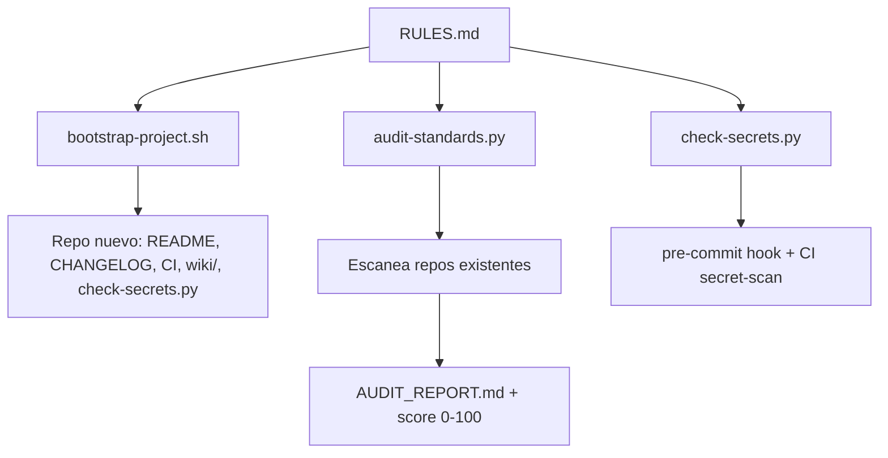

# dev-standards

Estándares de ingeniería, scaffolding y auditoría automatizada para el ecosistema de proyectos de luciomerlo.


## Arquitectura



## Qué contiene este repo

| Archivo / carpeta | Rol |
|---|---|
| [`RULES.md`](RULES.md) | Directivas obligatorias: arquitectura, resiliencia, versionado, seguridad de secretos (§6) |
| [`docs/code-standards.md`](docs/code-standards.md) | Nomenclatura, formato, testing, checklist de revisión |
| [`docs/commit-conventions.md`](docs/commit-conventions.md) | Convenciones de commits |
| `scripts/bootstrap-project.sh` | Genera el scaffolding completo en un repo nuevo (README, CHANGELOG, CI, `.gitignore`, Dockerfile, `wiki/`, guardarraíl de secretos) |
| `scripts/audit-standards.py` | Audita repos existentes contra RULES.md y genera `AUDIT_REPORT.md` con score 0-100 |
| `scripts/check-secrets.py` | Bloquea commits/CI con credenciales hardcodeadas (RULES.md §6) |
| [`wiki/`](wiki/Home.md) | Wiki operativa de este propio repo (onboarding, arquitectura, runbook) |

## Uso rápido

Scaffolding de un repo nuevo:

```bash
bash scripts/bootstrap-project.sh --lang python --name "MiProyecto" --desc "Descripción breve"
```

Auditar todos los proyectos bajo un directorio:

```bash
python scripts/audit-standards.py --root /ruta/a/Projects --fail-on-regression
```

Escanear secretos hardcodeados (usado por el pre-commit hook y el CI):

```bash
python scripts/check-secrets.py --tree      # árbol versionado
python scripts/check-secrets.py --history   # historial completo
```

## Configuración

Copie `.env.example` a `.env` si va a correr los scripts con credenciales (ej. tokens de GitHub para automatizar el scaffolding).

## Estándares aplicados (checklist visual)

| Estándar (RULES.md) | Estado |
|---|---|
| SemVer en manifiesto (`pyproject.toml`) | ✅ |
| CHANGELOG (Keep a Changelog) | ✅ |
| `.gitignore` | ✅ |
| Dockerfile | ✅ |
| CI/CD GitHub Actions | ✅ |
| `.env.example` | ✅ |
| Wiki (`wiki/`, §5.9) | ✅ |
| Escaneo de secretos (§6) | ✅ |

## Documentación

- [Wiki](wiki/Home.md) — onboarding, arquitectura y runbook
- [RULES.md](RULES.md) — estándares de arquitectura, resiliencia, versionado y seguridad
- [Estándares de código](docs/code-standards.md)
- [Convenciones de commits](docs/commit-conventions.md)

## Licencia

MIT — ver `LICENSE`.
