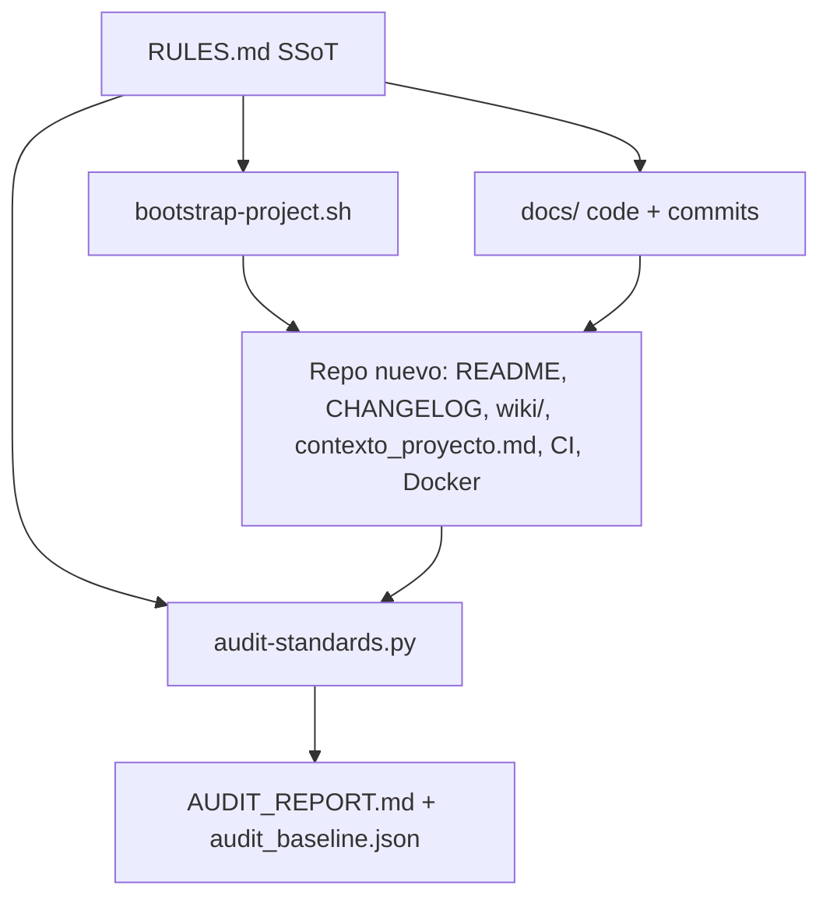

# Architecture — dev-standards

## Propósito

Este repositorio no es un producto de runtime: es el SSoT de cómo se construyen los demás repos. Las reglas viven en Markdown; el cumplimiento se materializa con un scaffold y se mide con un auditor.

## Vista general

## Capas

1. **Directivas** — `RULES.md` §1 arquitectura, §2 resiliencia, §3 rendimiento, §4 observabilidad, §5 integridad de repos (SemVer, CHANGELOG, README, descripción, Wiki, contexto para LLM).
2. **Convenciones de código** — `docs/code-standards.md` y `docs/commit-conventions.md`. No duplican RULES; cubren naming, lint, tests y el formato del commit.
3. **Generación** — `scripts/bootstrap-project.sh` crea el esqueleto mínimo que ya nace cumpliendo §5.
4. **Medición** — `scripts/audit-standards.py` recorre proyectos hermanos, puntúa checks y detecta regresiones contra `audit_baseline.json`.

## Decisiones

- **Wiki en `wiki/`, no solo el tab de GitHub.** El árbol del repo es la fuente de verdad: entra en PRs, se audita en frío y funciona sin API de GitHub. Publicar a `<repo>.wiki.git` es opcional.
- **README vs Wiki.** README: badges, diagrama, instalación, checklist. Wiki: onboarding, diseño, runbook. Ninguno sustituye al otro (§5.5 y §5.9).
- **Contexto para un LLM.** `contexto_proyecto.md` es el volcado de la base de código (resumen más contenido completo). Se regenera con `scripts/generate-contexto.py` en el mismo cambio que altere código, configuración o documentación normativa (§5.10). No reemplaza al README ni a la Wiki.
- **Una sola configuración de dominio.** `config.yaml` es el SSoT de parámetros; no se copian listas ni taxonomías entre módulos (§1.1).
- **Secretos: nunca en el árbol, siempre escaneados.** `scripts/check-secrets.py` corre en pre-commit y en CI (árbol + historial completo); un falso positivo se descarta con `# allowlist-secret`, nunca deshabilitando el chequeo (§6).
- **Cómputo: local nunca se elimina, lo remoto se suma.** Todo proyecto con carga GPU opcional detecta CUDA en runtime y ofrece hasta 4 backends remotos según su tier de peso (`colab`/`cloud-api`/`cloud-serverless`/`modal`), pero `local` sigue siendo una opción disponible siempre — ver [Compute](Compute.md) (§7).

## Mapa de RULES.md

| Sección | Tema |
|---------|------|
| §1 | SSoT, registry, modelos híbridos, memoria de agentes, esquemas flexibles |
| §2 | Retry/backoff, fallback multi-modelo, BD local, puertos |
| §3 | Zero-disk I/O, async, caché multinivel |
| §4 | Clasificación de errores, evidencia, `status.json` |
| §5 | SemVer, CHANGELOG, higiene, pins, README, bootstrap, auditoría, descripción, Wiki, contexto LLM |
| §6 | Prohibición de secretos hardcodeados, escaneo automatizado, falsos positivos, `.env` |
| §7 | Detección de CUDA, los 5 backends de cómputo, selección de UI/CLI, exclusión de modelos de difusión, implementación de referencia |
| §8 | Estética de dashboards: `apple-design-skill` (Apple HIG) fijado por commit, revisión obligatoria en PR, mínimos de contraste/tamaño/color/gráficos, anti-plantilla, tokens |
