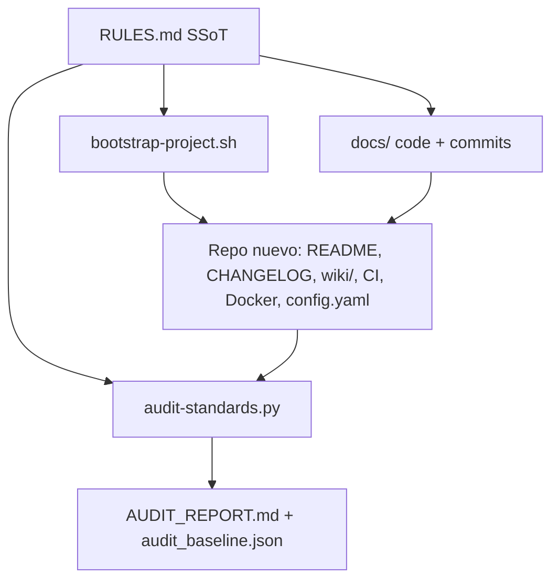

# Architecture — dev-standards

## Propósito

Este repositorio no es un producto de runtime: es el SSoT de cómo se construyen los demás repos. Las reglas viven en Markdown; el cumplimiento se materializa con un scaffold y se mide con un auditor.

## Vista general

## Capas

1. **Directivas** — `RULES.md` §1 arquitectura, §2 resiliencia, §3 rendimiento, §4 observabilidad, §5 integridad de repos (SemVer, CHANGELOG, README, descripción, Wiki).
2. **Convenciones de código** — `docs/code-standards.md` y `docs/commit-conventions.md`. No duplican RULES; cubren naming, lint, tests y el formato del commit.
3. **Generación** — `scripts/bootstrap-project.sh` crea el esqueleto mínimo que ya nace cumpliendo §5.
4. **Medición** — `scripts/audit-standards.py` recorre proyectos hermanos, puntúa checks y detecta regresiones contra `audit_baseline.json`.

## Decisiones

- **Wiki en `wiki/`, no solo el tab de GitHub.** El árbol del repo es la fuente de verdad: entra en PRs, se audita en frío y funciona sin API de GitHub. Publicar a `<repo>.wiki.git` es opcional.
- **README vs Wiki.** README: badges, diagrama, instalación, checklist. Wiki: onboarding, diseño, runbook. Ninguno sustituye al otro (§5.5 y §5.9).
- **Una sola configuración de dominio.** `config.yaml` es el SSoT de parámetros; no se copian listas ni taxonomías entre módulos (§1.1).

## Mapa de RULES.md

| Sección | Tema |
|---------|------|
| §1 | SSoT, registry, modelos híbridos, memoria de agentes, esquemas flexibles |
| §2 | Retry/backoff, fallback multi-modelo, BD local, puertos |
| §3 | Zero-disk I/O, async, caché multinivel |
| §4 | Clasificación de errores, evidencia, `status.json` |
| §5 | SemVer, CHANGELOG, higiene, pins, README, bootstrap, auditoría, descripción, Wiki |
